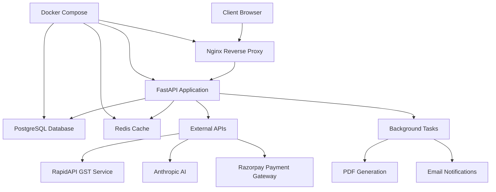

# 🚀 GST Intelligence Platform

[](https://github.com/gst-intelligence/platform)
[](https://python.org)
[](https://fastapi.tiangolo.com)
[](https://docker.com)
[](LICENSE)

> **Advanced GST Compliance Analytics Platform with AI-Powered Insights**

A comprehensive platform for GST compliance monitoring, business intelligence, and loan management with AI-powered insights and real-time analytics.

## 📑 Table of Contents

- [✨ Features](#-features)
- [🏗️ Architecture](#️-architecture)
- [🚀 Quick Start](#-quick-start)
- [📋 Prerequisites](#-prerequisites)
- [🛠️ Installation](#️-installation)
- [⚙️ Configuration](#️-configuration)
- [🐳 Docker Deployment](#-docker-deployment)
- [📊 API Documentation](#-api-documentation)
- [🧪 Testing](#-testing)
- [🔒 Security](#-security)
- [📈 Monitoring](#-monitoring)
- [🤝 Contributing](#-contributing)
- [📞 Support](#-support)

## ✨ Features

### 🔍 **GST Compliance & Analytics**
- **Real-time GSTIN Search**: Instant verification and compliance scoring
- **Advanced Analytics**: Comprehensive dashboards with trends and insights
- **Search History**: Complete audit trail with exportable reports
- **Compliance Scoring**: AI-powered risk assessment and recommendations

### 🤖 **AI-Powered Insights**
- **Anthropic AI Integration**: Intelligent business analysis
- **Risk Assessment**: Automated compliance risk evaluation
- **Trend Analysis**: Pattern recognition and predictive insights
- **Smart Recommendations**: Data-driven business suggestions

### 💰 **Loan Management** *(Optional)*
- **Razorpay Integration**: Seamless payment processing
- **Application Management**: End-to-end loan lifecycle
- **Risk Evaluation**: Credit scoring based on GST compliance
- **Automated Processing**: Streamlined approval workflows

### 🔧 **Technical Excellence**
- **Progressive Web App**: Offline-capable mobile experience
- **Production-Ready**: Scalable architecture with Docker support
- **Security-First**: Multi-layer security with rate limiting
- **Performance Optimized**: Caching, CDN, and database optimization

## 🏗️ Architecture



### 🔄 **Tech Stack**
- **Backend**: FastAPI (Python 3.11+)
- **Database**: PostgreSQL 15+ with asyncpg
- **Cache**: Redis 7+
- **Frontend**: Modern JavaScript, PWA
- **Proxy**: Nginx with SSL termination
- **Containerization**: Docker & Docker Compose
- **Monitoring**: Prometheus & Grafana
- **Testing**: Pytest with async support

## 🚀 Quick Start

### 1️⃣ **Clone & Setup**
```bash
git clone https://github.com/gst-intelligence/platform.git
cd gst-intelligence-platform

# Copy environment template
cp .env.example .env

# Edit configuration
nano .env
```

### 2️⃣ **Development Mode**
```bash
# Start services
docker-compose up -d postgres redis

# Install dependencies
pip install -r requirements.txt

# Initialize database
python init_database.py

# Run development server
python -m uvicorn main:app --reload --host 0.0.0.0 --port 8000
```

### 3️⃣ **Production Deployment**
```bash
# Deploy with all services
./scripts/deploy.sh -e production

# Or quick production start
docker-compose --profile production up -d
```

### 4️⃣ **Access Application**
- **Application**: http://localhost:8000
- **Admin Panel**: http://localhost:8000/admin
- **API Docs**: http://localhost:8000/docs
- **Health Check**: http://localhost:8000/health

## 📋 Prerequisites

### **System Requirements**
- **OS**: Linux, macOS, or Windows with WSL2
- **Memory**: 4GB RAM minimum, 8GB recommended
- **Storage**: 10GB free space
- **Network**: Internet connection for external APIs

### **Software Dependencies**
- **Docker**: 20.10+ and Docker Compose V2
- **Python**: 3.11+ (for local development)
- **Git**: Latest version
- **curl**: For health checks and deployment

### **External Services**
- **RapidAPI Account**: For GST data access
- **Anthropic API**: For AI insights (optional)
- **Razorpay Account**: For loan management (optional)
- **PostgreSQL**: 15+ (local or hosted)
- **Redis**: 7+ (local or hosted)

## 🛠️ Installation

### **Option 1: Docker (Recommended)**

```bash
# 1. Clone repository
git clone https://github.com/gst-intelligence/platform.git
cd gst-intelligence-platform

# 2. Configure environment
cp .env.example .env
# Edit .env with your configuration

# 3. Deploy
chmod +x scripts/deploy.sh
./scripts/deploy.sh -e production
```

### **Option 2: Manual Installation**

```bash
# 1. Install Python dependencies
pip install -r requirements.txt

# 2. Setup PostgreSQL database
createdb gstintelligence
psql gstintelligence < init.sql

# 3. Initialize database
python init_database.py

# 4. Start Redis
redis-server

# 5. Run application
python -m uvicorn main:app --host 0.0.0.0 --port 8000
```

### **Option 3: Development Setup**

```bash
# 1. Create virtual environment
python -m venv venv
source venv/bin/activate  # Linux/macOS
# venv\Scripts\activate  # Windows

# 2. Install development dependencies
pip install -r requirements.txt
pip install -r requirements-dev.txt

# 3. Setup pre-commit hooks
pre-commit install

# 4. Run development server
python -m uvicorn main:app --reload
```

## ⚙️ Configuration

### **Environment Variables**

| Variable | Description | Default | Required |
|----------|-------------|---------|----------|
| `ENVIRONMENT` | Deployment environment | `development` | Yes |
| `DEBUG` | Enable debug mode | `false` | No |
| `SECRET_KEY` | Session encryption key | - | Yes |
| `POSTGRES_DSN` | Database connection string | - | Yes |
| `REDIS_URL` | Redis connection URL | - | No |
| `RAPIDAPI_KEY` | RapidAPI authentication key | - | Yes |
| `RAPIDAPI_HOST` | GST API host | `gst-return-status.p.rapidapi.com` | Yes |
| `ANTHROPIC_API_KEY` | Anthropic AI API key | - | No |

### **Feature Flags**

```env
# Core Features
ENABLE_AI_FEATURES=true
ENABLE_PDF_GENERATION=true
ENABLE_CACHING=true
ENABLE_ANALYTICS=true

# Optional Features
ENABLE_LOAN_MANAGEMENT=false
ENABLE_EMAIL_NOTIFICATIONS=false
```

### **Security Configuration**

```env
# Session Management
SESSION_DURATION=2592000  # 30 days
SESSION_SECURE=true       # HTTPS only

# Rate Limiting
RATE_LIMIT_ENABLED=true
LOGIN_RATE_LIMIT=5
API_RATE_LIMIT=100

# CORS Settings
CORS_ORIGINS=https://yourdomain.com
CORS_CREDENTIALS=true
```

## 🐳 Docker Deployment

### **Single Command Deployment**

```bash
# Production deployment with all services
docker-compose --profile production up -d

# Development environment
docker-compose --profile development up -d

# With monitoring stack
docker-compose --profile production --profile monitoring up -d
```

### **Advanced Deployment**

```bash
# Custom build with version
export VERSION=2.1.0
export BUILD_DATE=$(date -u +'%Y-%m-%dT%H:%M:%SZ')

docker build \
  --build-arg VERSION=$VERSION \
  --build-arg BUILD_DATE=$BUILD_DATE \
  -t gst-intelligence:$VERSION .

# Deploy with custom configuration
export ENVIRONMENT=production
docker-compose -f docker-compose.yml -f docker-compose.prod.yml up -d
```

### **Service Management**

```bash
# Check service status
docker-compose ps

# View logs
docker-compose logs -f app

# Scale application
docker-compose up -d --scale app=3

# Update services
docker-compose pull
docker-compose up -d

# Backup database
docker-compose exec postgres pg_dump -U gstuser gstintelligence > backup.sql
```

## 📊 API Documentation

### **Core Endpoints**

| Method | Endpoint | Description | Auth Required |
|--------|----------|-------------|---------------|
| `GET` | `/health` | Health check | No |
| `POST` | `/login` | User authentication | No |
| `POST` | `/signup` | User registration | No |
| `POST` | `/search` | GSTIN search | Yes |
| `GET` | `/history` | Search history | Yes |
| `GET` | `/analytics` | Analytics dashboard | Yes |

### **API Examples**

```bash
# Health check
curl http://localhost:8000/health

# User registration
curl -X POST http://localhost:8000/signup \
  -H "Content-Type: application/json" \
  -d '{"mobile":"9876543210","password":"securepass123"}'

# GSTIN search
curl -X POST http://localhost:8000/search \
  -H "Content-Type: application/json" \
  -H "Cookie: session_token=your_token" \
  -d '{"gstin":"07AABCU9603R1ZX"}'

# Get user statistics
curl http://localhost:8000/api/user/stats \
  -H "Cookie: session_token=your_token"
```

### **Response Format**

```json
{
  "success": true,
  "data": {
    "gstin": "07AABCU9603R1ZX",
    "company_name": "Example Company Ltd",
    "status": "Active",
    "compliance_score": 85,
    "registration_date": "2020-01-15",
    "business_type": "Private Limited Company"
  },
  "timestamp": "2024-01-15T10:30:00Z"
}
```

## 🧪 Testing

### **Running Tests**

```bash
# Run all tests
pytest tests/ -v

# Run with coverage
pytest tests/ --cov=. --cov-report=html

# Run specific test categories
pytest tests/ -m "not slow"  # Exclude slow tests
pytest tests/ -m "unit"      # Only unit tests
pytest tests/ -m "integration"  # Only integration tests

# Run tests in Docker
docker-compose run --rm app pytest tests/ -v
```

### **Test Categories**

- **Unit Tests**: Individual function and class testing
- **Integration Tests**: Database and API integration
- **Security Tests**: Authentication and authorization
- **Performance Tests**: Load and stress testing
- **End-to-End Tests**: Complete workflow testing

### **Test Coverage**

```bash
# Generate coverage report
pytest --cov=. --cov-report=html --cov-report=term-missing

# View coverage
open htmlcov/index.html
```

## 🔒 Security

### **Security Features**

- ✅ **Authentication**: Session-based with secure cookies
- ✅ **Authorization**: Role-based access control
- ✅ **Input Validation**: Comprehensive data sanitization
- ✅ **Rate Limiting**: API and login protection
- ✅ **SQL Injection Protection**: Parameterized queries
- ✅ **XSS Prevention**: Content security policy
- ✅ **HTTPS Enforcement**: SSL/TLS in production
- ✅ **Security Headers**: Comprehensive header protection

### **Security Configuration**

```nginx
# Security headers in Nginx
add_header X-Frame-Options "SAMEORIGIN" always;
add_header X-Content-Type-Options "nosniff" always;
add_header X-XSS-Protection "1; mode=block" always;
add_header Strict-Transport-Security "max-age=63072000; includeSubDomains; preload" always;
add_header Content-Security-Policy "default-src 'self';" always;
```

### **Security Best Practices**

1. **Regular Updates**: Keep dependencies updated
2. **Secret Management**: Use environment variables
3. **Database Security**: Regular backups and encryption
4. **Monitoring**: Log security events and anomalies
5. **Access Control**: Principle of least privilege

## 📈 Monitoring

### **Health Monitoring**

```bash
# Application health
curl http://localhost:8000/health

# Database health
docker-compose exec postgres pg_isready

# Redis health
docker-compose exec redis redis-cli ping
```

### **Logging**

```bash
# Application logs
docker-compose logs -f app

# Database logs
docker-compose logs -f postgres

# All services
docker-compose logs -f
```

### **Metrics Collection**

- **Prometheus**: Metrics collection and storage
- **Grafana**: Visualization and alerting
- **Application Metrics**: Request count, response time, error rate
- **System Metrics**: CPU, memory, disk usage
- **Business Metrics**: Search count, user activity, compliance scores

### **Alerts Configuration**

```yaml
# Grafana alert example
- alert: HighErrorRate
  expr: rate(http_requests_total{status=~"5.."}[5m]) > 0.1
  for: 5m
  annotations:
    summary: High error rate detected
    description: Error rate is above 10% for 5 minutes
```

## 🔄 Maintenance

### **Database Backup**

```bash
# Manual backup
docker-compose exec postgres pg_dump -U gstuser gstintelligence > backup_$(date +%Y%m%d).sql

# Automated backup script
./scripts/backup.sh

# Restore from backup
cat backup_20240115.sql | docker-compose exec -T postgres psql -U gstuser gstintelligence
```

### **Updates & Upgrades**

```bash
# Update application
git pull origin main
docker-compose build app
docker-compose up -d app

# Update all services
docker-compose pull
docker-compose up -d

# Database migration
docker-compose run --rm app python init_database.py
```

### **Performance Optimization**

1. **Database Optimization**
   - Regular VACUUM and ANALYZE
   - Index optimization
   - Query performance monitoring

2. **Cache Management**
   - Redis memory optimization
   - Cache invalidation strategies
   - Cache hit rate monitoring

3. **Application Optimization**
   - Code profiling
   - Database query optimization
   - Static asset compression

## 🤝 Contributing

We welcome contributions! Please read our [Contributing Guide](CONTRIBUTING.md) for details.

### **Development Workflow**

1. Fork the repository
2. Create a feature branch: `git checkout -b feature/amazing-feature`
3. Make your changes and add tests
4. Run tests: `pytest tests/ -v`
5. Commit changes: `git commit -m 'Add amazing feature'`
6. Push to branch: `git push origin feature/amazing-feature`
7. Create a Pull Request

### **Code Standards**

- **Python**: Follow PEP 8 with Black formatting
- **JavaScript**: ES6+ with consistent style
- **Documentation**: Clear docstrings and comments
- **Testing**: Maintain 90%+ test coverage
- **Security**: Security-first development approach

## 📞 Support

### **Getting Help**

- 📖 **Documentation**: [docs.gst-intelligence.com](https://docs.gst-intelligence.com)
- 🐛 **Bug Reports**: [GitHub Issues](https://github.com/gst-intelligence/platform/issues)
- 💬 **Discussions**: [GitHub Discussions](https://github.com/gst-intelligence/platform/discussions)
- 📧 **Email**: support@gst-intelligence.com

### **Commercial Support**

For enterprise support, custom development, and consulting services:
- 🏢 **Enterprise**: enterprise@gst-intelligence.com
- 💼 **Consulting**: consulting@gst-intelligence.com
- 🔧 **Custom Development**: dev@gst-intelligence.com

### **Community**

- 🐦 **Twitter**: [@GSTIntelligence](https://twitter.com/GSTIntelligence)
- 💼 **LinkedIn**: [GST Intelligence Platform](https://linkedin.com/company/gst-intelligence)
- 📱 **Telegram**: [t.me/gstintelligence](https://t.me/gstintelligence)

## 📄 License

This project is licensed under the MIT License - see the [LICENSE](LICENSE) file for details.

## 🏆 Acknowledgments

- **FastAPI**: For the excellent web framework
- **PostgreSQL**: For robust database capabilities
- **Redis**: For high-performance caching
- **Docker**: For containerization support
- **Anthropic**: For AI capabilities
- **RapidAPI**: For GST data access
- **Open Source Community**: For amazing tools and libraries

---

<div align="center">

**Made with ❤️ for the GST compliance community**

[⭐ Star this repo](https://github.com/gst-intelligence/platform) | [🐛 Report Bug](https://github.com/gst-intelligence/platform/issues) | [💡 Request Feature](https://github.com/gst-intelligence/platform/issues)

</div>